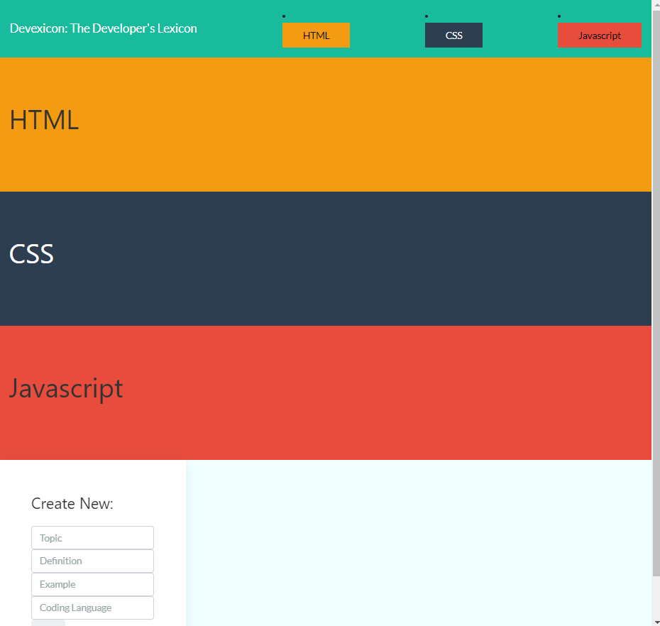
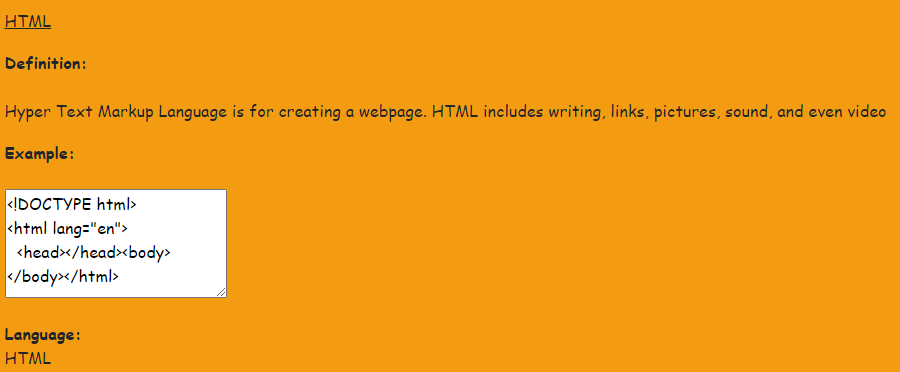
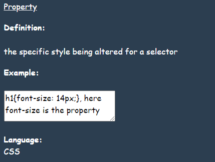
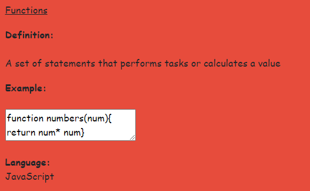
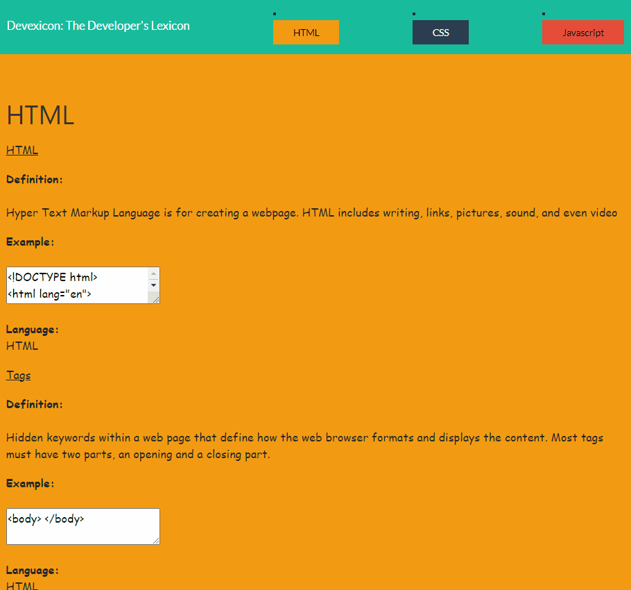

  <h1 align= "center">Devexicon</h1> 
  <h2>Table of Contents<h2>
  <ul>
  <li><a href="#descrip">Description</a></li>  
  <li><a href="#install">Installation</a></li> 
  <li><a href="#tech">Technology</a></li> 
  <li><a href="#use">Usage</a></li> 
  <li><a href="#license">License</a></li>
  <li><a href="#screen">Screenshots</a></li> 
  <li><a href="#contr">Contributors</a></li> 
  <li><a href="#quest">Questions</a></li>  
  </ul>
    

  
<h2>Description</h2> 

  A Developers Definition Lexicon
  

  
<h2>Installation</h2> 

  
Create an link database to config file, npm install necessary packages, add definitions and languages as desired.

  

  
<h2>Technology</h2>
           
  
 HTML, CSS, Bootstrap, APIs, JSON, Node.Js, Express, JavaScript, MySQL, Heroku,Handlebars

  

  
<h2>Usage</h2>

  
Reference information 
  
  

  
<h2>License</h2>

  

 
  

  
<h2>Screenshots</h2>

  
  

  

  
<h2>Contributors</h2> 

  Gregory Clark       
  <ul>
  <li>Github: <a href= "https://github.com/gregroyclark/">https://github.com/gregroyclark/</a></li>
  <li>Portfolio: <a href= "https://gregroyclark.github.io/">https://gregroyclark.github.io/</a></li>    
  <li>LinkedIn: <a href= "https://www.linkedin.com/in/gregoryclark">https://www.linkedin.com/in/gregoryclark</a></li>
  </ul>  

   Garrett Griffey      
  <ul>
  <li>Github: <a href= "https://github.com/garrettwgriffey">https://github.com/garrettwgriffeyv</a></li>
  <li>Portfolio: <a href= "http://garrettwgriffey.github.io">https://garrettwgriffey.github.io</a></li>
  <li>LinkedIn: <a href= "https://www.linkedin.com/in/garrettwgriffey">https://www.linkedin.com/in/garrettwgriffey</a></li>
  </ul>       

  Rogerson Jean-Charles      
  <ul>
  <li>Github: <a href= "https://github.com/Rogerson253">https://github.com/Rogerson253</a></li>
  <li>Portfolio: <a href= "https://rogerson253.github.io/">https://rogerson253.github.io/</a></li>   
  <li>LinkedIn: <a href= "https://www.linkedin.com/in/rogerson-jean-charles253/">https://www.linkedin.com/in/rogerson-jean-charles253/</a></li>
  </ul> 

  Annaruth McBride       
  <ul>
  <li>Github: <a href= "https://github.com/armcbride">https://github.com/armcbride</a></li>
  <li>Portfolio: <a href= "armcbride.github.io">armcbride.github.io</a></li>     
  <li>LinkedIn: <a href= "https://www.linkedin.com/in/annaruthmcbride">https://www.linkedin.com/in/annaruthmcbride</a></li>
  </ul> 
  
